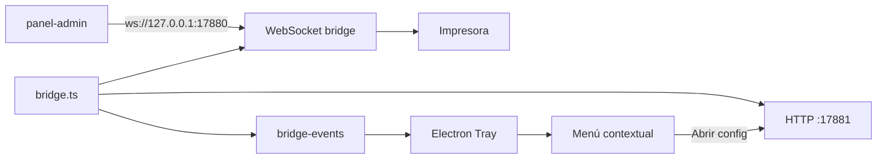

# PRP: Maxy Print Bridge — bandeja del sistema (Electron core)

> **Version:** 1.0
> **Created:** 2026-06-05
> **Status:** Ready
> **Repo:** `print-bridge` (Electron + Node, Windows primero)

**Dependencia:** Ejecutar antes de `PRPs/006--system-tray-installer-ci-release.md`.

**PRPs relacionados:**
- Windows base: `PRPs/001--impresion-termica-bridge-windows.md`
- Instalador + CI: `PRPs/006--system-tray-installer-ci-release.md`
- Panel instrucciones: `panel-admin-ag360ai/PRPs/083--print-bridge-tray-instructions-panel.md`
- Backend: `ssgg/PRPs/056--impresion-termica-socket-payload.md` (sin cambios)

**Documentación de despliegue:** actualizar `PRINT_BRIDGE_DEPLOY.md` y `README.md` al implementar.

---

## Goal

Convertir el bridge de un **`.exe` de consola (`pkg`)** en una aplicación **sin ventana visible** con **icono en la bandeja del sistema** (system tray), manteniendo el contrato actual con el panel:

| Qué | Valor (sin cambio) |
|-----|-------------------|
| WebSocket | `ws://127.0.0.1:17880` |
| Config impresora | `http://127.0.0.1:17881` |
| Config persistida | `%APPDATA%\MaxyPrintBridge\config.json` |
| Logs | `%APPDATA%\MaxyPrintBridge\bridge.log` |

Entregable de esta fase: app Electron que arranca el bridge en segundo plano, muestra menú contextual completo en la bandeja, notificaciones nativas, instancia única, ticket de prueba y diagnóstico de soporte.

---

## Why

- Hoy el restaurante debe **dejar abierta una ventana negra de consola** (`console-exit.ts` + `logPackagedStartupBanner`).
- Eso genera confusión (“¿puedo cerrar esta ventana?”), agrupa el proceso bajo Terminal en Windows 11 y no se parece a apps profesionales de caja.
- El panel ya detecta el bridge vía ping WebSocket; **no requiere cambios de protocolo** para la bandeja.
- Electron da tray, notificaciones, `setLoginItemSettings`, abrir URLs/carpetas y single-instance de forma estable; `pkg` + librerías tray nativas son frágiles en CI.

---

## What

### Arquitectura objetivo

```
electron/main.ts          → Tray, menú, notificaciones, single instance, autoarranque
electron/tray-state.ts    → Iconos, tooltip, refresco de menú
src/bridge.ts             → startBridge() / stopBridge() — lógica extraída de index.ts
src/bridge-events.ts      → EventEmitter tipado (print, config, lifecycle)
src/index.ts              → Entry CLI legacy (npm run dev / pkg) — delega a bridge.ts
src/test-print.ts         → Payload mínimo de ticket de prueba
assets/                   → icon.ico + icon-tray-{ready,warn,error,printing}.png
```



### Refactor: `src/bridge.ts` (NUEVO)

Extraer de `src/index.ts` una API reutilizable:

```typescript
export type BridgeState = 'starting' | 'ready' | 'no-printer' | 'printing' | 'error';

export interface BridgeStatus {
  state: BridgeState;
  wsPort: number;
  uiPort: number;
  printerName: string | null;
  printerType: 'thermal' | 'regular';
  lastPrintAt: string | null;
  lastPrintOrderId: string | null;
  lastError: string | null;
  queuePending: number;
}

export interface BridgeHandle {
  getStatus(): BridgeStatus;
  stop(): Promise<void>;
  on(event: 'status', listener: (s: BridgeStatus) => void): void;
  on(event: 'notification', listener: (n: BridgeNotification) => void): void;
}

export async function startBridge(options?: {
  /** false en entry CLI con consola */
  packaged?: boolean;
}): Promise<BridgeHandle>;
```

**Reglas de migración:**

- Mover lógica de `main()` en `index.ts` a `startBridge()`.
- Emitir eventos en:
  - arranque OK / puerto en uso (`handlePortInUse`)
  - `print:started` / `print:success` / `print:error` (handler WebSocket actual)
  - cambio de config (hook en `settings-server.ts` tras `writeUserConfig`)
- `index.ts` conserva entry para `npm run dev` y compatibilidad temporal con `pkg` (hasta PRP 006).

### Refactor: `src/bridge-events.ts` (NUEVO)

```typescript
import { EventEmitter } from 'events';

export interface BridgeNotification {
  kind: 'info' | 'success' | 'warning' | 'error';
  title: string;
  body: string;
}

export class BridgeEventBus extends EventEmitter {
  emitStatus(status: BridgeStatus): void;
  emitNotification(n: BridgeNotification): void;
}
```

### Extender config: `src/config-store.ts`

**MODIFY:** ampliar `BridgeUserConfig`:

```typescript
export interface BridgeUserConfig {
  printerName: string | null;
  printerType: 'thermal' | 'regular';
  /** Persistido; sincronizado con app.setLoginItemSettings en Electron */
  openAtLogin?: boolean;
  /** Master switch de notificaciones nativas */
  showNotifications?: boolean;
  /** Toast al imprimir OK (default false — menos ruido en caja) */
  notifyOnSuccess?: boolean;
  /** Toast en error de impresión (default true) */
  notifyOnError?: boolean;
}
```

Defaults al leer (`readUserConfig`):

```typescript
openAtLogin: j.openAtLogin ?? false,
showNotifications: j.showNotifications ?? true,
notifyOnSuccess: j.notifyOnSuccess ?? false,
notifyOnError: j.notifyOnError ?? true,
```

### Ticket de prueba: `src/test-print.ts` (NUEVO)

```typescript
import type { ThermalPrintPayload } from './types';

export function buildTestPrintPayload(): ThermalPrintPayload {
  // Ticket mínimo ESC/POS: título "PRUEBA", fecha/hora, versión app
  // orderId: 'TEST-PRINT'
}
```

Reutilizar `printThermalPayload()` + `resolvePrinterForPrint()`.

### Electron main: `electron/main.ts` (NUEVO)

Responsabilidades:

1. **`app.requestSingleInstanceLock()`**
   - Segunda ejecución → notificación “Ya está en ejecución” + opcional abrir `http://127.0.0.1:17881`.
   - Reutilizar lógica de `isBridgeAlreadyRunning()` como respaldo.

2. **`Tray` sin ventana principal**
   - `new Tray(nativeImage)` con icono según `BridgeStatus.state`.
   - Tooltip dinámico (ver sección Menú).

3. **Menú contextual (clic derecho)**

```
Maxy Print Bridge v{version}
─────────────────────────────
● {Estado} — ws://127.0.0.1:17880
  Impresora: {nombre | "Sin configurar"} ({thermal|regular})
  Último ticket: {orderId | "—"} {hace X min | ""}
─────────────────────────────
  Abrir configuración de impresora
  Imprimir ticket de prueba
─────────────────────────────
  Abrir carpeta de logs
  Copiar información de soporte
─────────────────────────────
  ☑ Iniciar con Windows          → toggle openAtLogin + setLoginItemSettings
  ☑ Mostrar notificaciones       → toggle showNotifications
  ☐ Avisar cuando imprime OK     → toggle notifyOnSuccess (sub-opcional)
─────────────────────────────
  Acerca de…
  Salir
```

4. **Clic izquierdo en icono:** abrir `http://127.0.0.1:17881` (`shell.openExternal`).

5. **Notificaciones (`Notification`)**
   - Primer arranque: “Configure su impresora en el navegador.”
   - Error impresión (si `notifyOnError`).
   - Éxito (si `notifyOnSuccess`).
   - Respetar `showNotifications === false`.

6. **Salida limpia**
   - Menú “Salir” → `bridge.stop()` → `app.quit()`.
   - Cerrar WS y HTTP server antes de salir.

7. **`app.setLoginItemSettings({ openAtLogin })`** al togglear “Iniciar con Windows”; persistir en `config.json`.

### Iconos y estados: `electron/tray-state.ts` (NUEVO)

| `BridgeState` | Icono | Tooltip base |
|---------------|-------|--------------|
| `ready` | `icon-tray-ready.png` | Activo |
| `no-printer` | `icon-tray-warn.png` | Sin impresora configurada |
| `printing` | `icon-tray-printing.png` | Imprimiendo… |
| `error` | `icon-tray-error.png` | Error — ver menú |
| `starting` | `icon-tray-ready.png` (gris opcional) | Iniciando… |

Refrescar menú + tooltip en cada evento `status`.

### Copiar info de soporte

Menú → clipboard vía `clipboard.writeText()`:

```text
Maxy Print Bridge {version}
OS: {platform} {release}
Impresora: {printerName} ({printerType})
Config: {configFilePath()}
WS: ws://127.0.0.1:17880 — {OK|ERROR}
UI: http://127.0.0.1:17881 — {OK|ERROR}
Último error: {lastError || ninguno}
Log: {bridge.log path}
```

### Ajustes en archivos existentes

**MODIFY:** `src/index.ts`

- Importar y llamar `startBridge()` para modo CLI.
- Mantener handlers `uncaughtException` / `unhandledRejection`.

**MODIFY:** `src/console-exit.ts`

- Exportar `isElectronMode(): boolean` (detectar `process.versions.electron` o env `MAXY_BRIDGE_ELECTRON=1`).
- **No** llamar `exitWithConsolePause` ni `logPackagedStartupBanner` en modo Electron.
- En CLI/pkg seguir comportamiento actual hasta deprecación en PRP 006.

**MODIFY:** `src/settings-server.ts`

- Tras `writeUserConfig`, emitir evento `config:changed` vía bus compartido (inyectar callback o importar singleton `bridgeEventBus`).

**MODIFY:** `package.json`

```json
{
  "main": "dist/electron/main.js",
  "scripts": {
    "build": "tsc",
    "build:electron": "tsc && node scripts/copy-electron-assets.mjs",
    "electron:dev": "npm run build:electron && electron .",
    "electron:start": "electron ."
  },
  "dependencies": {
    "electron": "^33.0.0"
  },
  "devDependencies": {
    "electron": "^33.0.0"
  }
}
```

> `electron` en `devDependencies` para dev; en build empaquetado lo incluye `electron-builder` (PRP 006).

**NUEVO:** `tsconfig.json` — incluir `electron/**/*.ts` en compilación o proyecto separado `tsconfig.electron.json`.

**NUEVO:** `scripts/copy-electron-assets.mjs` — copiar `assets/` a `dist/electron/assets/`.

### Dependencias npm

| Paquete | Uso |
|---------|-----|
| `electron` | Shell tray |
| (existentes) `ws`, `node-thermal-printer` | Sin cambio |

No añadir `systray2` ni `node-tray`.

---

## Tareas

### Task 1 — Refactor `startBridge()`

1. Crear `src/bridge-events.ts`, `src/bridge.ts`.
2. Mover servidores WS + settings desde `index.ts`.
3. Exponer `getStatus()` con cola (`SerialPrintQueue` — contador pending si es posible).
4. Tests manuales: `npm run dev` sigue funcionando igual.

### Task 2 — Electron tray MVP

1. Crear `electron/main.ts`, `electron/tray-state.ts`.
2. Icono placeholder en `assets/`.
3. Menú mínimo: Configuración, Logs, Salir.
4. Sin ventana de consola al ejecutar `npm run electron:dev`.

### Task 3 — Menú completo + estados

1. Iconos por estado.
2. Tooltip con impresora y último ticket.
3. Ticket de prueba.
4. Copiar soporte.
5. Checkboxes autoarranque y notificaciones.

### Task 4 — Notificaciones + instancia única

1. `requestSingleInstanceLock`.
2. Toasts en eventos definidos.
3. Respetar flags de `config.json`.

### Task 5 — Integración settings-server

1. Refrescar tray al guardar impresora.
2. Transición `no-printer` → `ready`.

---

## Success Criteria

- [ ] `npm run electron:dev` en Windows: **sin ventana de consola**, icono visible en bandeja (↑ aplicaciones en segundo plano).
- [ ] Clic izquierdo abre `http://127.0.0.1:17881`.
- [ ] Panel en la misma PC: ping/pong OK (`checkPrintBridgeReachable`).
- [ ] Impresión desde Operaciones funciona igual que con consola.
- [ ] Segunda ejecución del `.exe` no abre segunda instancia; muestra aviso.
- [ ] “Imprimir ticket de prueba” imprime en impresora configurada.
- [ ] “Copiar información de soporte” pega datos útiles en portapapeles.
- [ ] “Iniciar con Windows” persiste y aplica `setLoginItemSettings`.
- [ ] Errores de impresión muestran notificación (con `notifyOnError: true`).
- [ ] `npm run dev` (CLI) sigue operativo para desarrollo.
- [ ] Logs en `%APPDATA%\MaxyPrintBridge\bridge.log` sin regresión.

---

## Out Of Scope (esta fase)

- Instalador NSIS y CI (`PRPs/006`).
- Ventana de estado dedicada (panel HTML embebido) — opcional futuro.
- Comprobador de actualizaciones GitHub Releases — PRP 006.
- Firma de código Authenticode.
- macOS Menu Bar / Linux StatusNotifier — fase posterior; Windows primero.
- Cambios en `ssgg` o protocolo WebSocket.
- Autenticación panel ↔ bridge.

---

## All Needed Context

```yaml
LEER:
  - src/index.ts
  - src/console-exit.ts
  - src/config-store.ts
  - src/settings-server.ts
  - src/bridge-probe.ts
  - src/file-logger.ts
  - src/print-queue.ts
  - src/format-ticket.ts
  - src/resolve-printer.ts
  - package.json

PANEL (contrato — sin cambios de protocolo):
  - panel-admin: src/services/localPrintBridge.ts
  - panel-admin: src/pages/DatosMarca2/components/configs/LocalPrintingConfig.tsx

PUERTOS:
  - src/ports.ts → WS 17880, UI 17881
```

---

## Gotchas

```text
GOTCHA 1: Electron main debe compilarse a CommonJS o usar "type":"module" con cuidado;
  alinear tsconfig con el resto del proyecto.

GOTCHA 2: No llamar process.exit() desde bridge sin stop() — dejar sockets en TIME_WAIT.

GOTCHA 3: En dev, electron . carga dist/electron/main.js; asegurar build previo.

GOTCHA 4: Notification en Windows requiere app user model ID:
  app.setAppUserModelId('com.maxy.print-bridge') en main.

GOTCHA 5: Impresión RAW/PDF (win-raw-print, win-pdf-print) usa spawn con windowsHide: true;
  compatible con Electron sin cambios.

GOTCHA 6: Mantener pkg:win funcional hasta PRP 006 para no romper releases en curso.

GOTCHA 7: Tooltip de tray en Windows tiene límite ~128 caracteres; acortar texto.

GOTCHA 8: "Abrir carpeta de logs" → shell.openPath(configDir()) en Electron.
```

---

## Cross-repo checklist

| Repo | Acción |
|------|--------|
| `print-bridge` | Este PRP — Electron tray core |
| `print-bridge` | PRP 006 — instalador + CI |
| `panel-admin-ag360ai` | PRP 083 — textos “bandeja” en LocalPrintingConfig |
| `ssgg` | Sin cambios |
